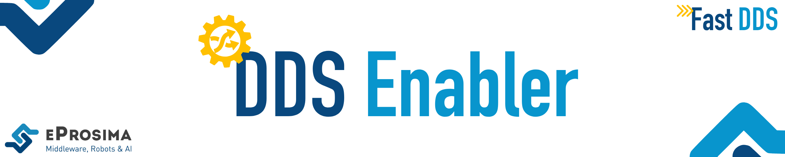

 

  <strong>
    <a href="https://eprosima.com/index.php/downloads-all">Download</a>
    &nbsp;&nbsp;•&nbsp;&nbsp;
    <a href="https://dds-enabler.readthedocs.io/en/latest/">Docs</a>
    &nbsp;&nbsp;•&nbsp;&nbsp;
    <a href="https://eprosima.com/index.php/company-all/news">News</a>
    &nbsp;&nbsp;•&nbsp;&nbsp;
    <a href="https://x.com/EProsima">X</a>
    &nbsp;&nbsp;•&nbsp;&nbsp;
    <a href="mailto:info@eprosima.com">Contact Us</a>
  </strong>

  

  
  
  
  
  
   
  
  
  

  

*eProsima DDS Enabler* is a modular middleware framework that connects DDS networks with an external system or data platform, delivering real-time, bidirectional interoperability. It orchestrates all necessary DDS participants, auto-discovers topics and types, and flexibly translates DDS samples into your target data model — and routes incoming context updates or events back into DDS topics.

**Key features**
- **Unified DDS Participant Management**
  Auto-create and discover DomainParticipants, Publishers, Subscribers, Topics and Types without manual code.
- **Flexible YAML Configuration**
  Fine-tune QoS, network filters, topic allow-listing/deny-listing and discovery via a human-readable YAML file.
- **Dynamic Types via XTypes**
Leverage [OMG DDS-XTypes 1.3](https://www.omg.org/spec/DDS-XTypes/1.3) and Fast DDS serialization utilities for runtime type registration and discovery.
- **Core Engine Powered by DDS-Pipe**
  Built on [eProsima DDS Pipe](https://github.com/eProsima/DDS-Pipe), ensuring low-latency, high-throughput payload forwarding and reliable discovery across distributed systems.
- **Serialization Utilities**
  Convert DDS data to JSON and vice versa for REST integration and to human-readable IDL.

## Platforms using DDS Enabler
- **FIWARE NGSI-LD Context Broker**
  Developed in collaboration with the FIWARE Context Broker team, *eProsima DDS Enabler* routes DDS samples into the broker (via broker-side implementation) and propagates Context Broker's context updates back into DDS topics.

## Commercial support

Looking for commercial support? Write us to info@eprosima.com

Find more about us at [eProsima’s webpage](https://eprosima.com/).

## Documentation

Explore the full user and developer guide hosted on ReadTheDocs:

- [Introduction](https://dds-enabler.readthedocs.io/en/latest/rst/02-formalia/titlepage.html)
- [Project Overview](https://dds-enabler.readthedocs.io/en/latest/rst/getting_started/project_overview.html)
- [User Manual](https://dds-enabler.readthedocs.io/en/latest/rst/user_manual/context_broker_interface.html)
- [API Reference](https://dds-enabler.readthedocs.io/en/latest/rst/ddsenabler/api_reference/api_reference.html)
